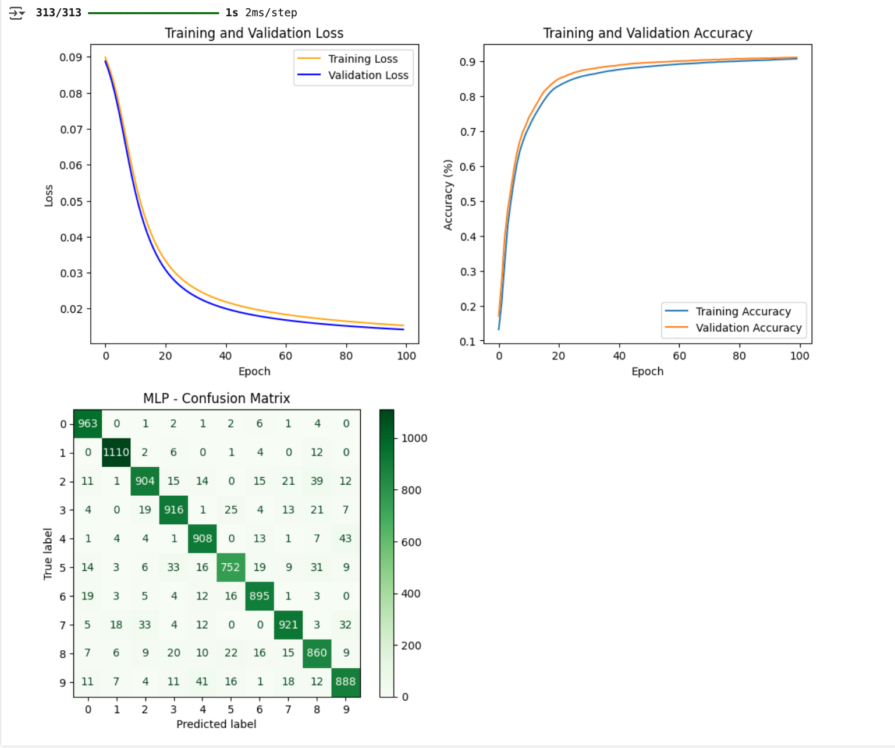
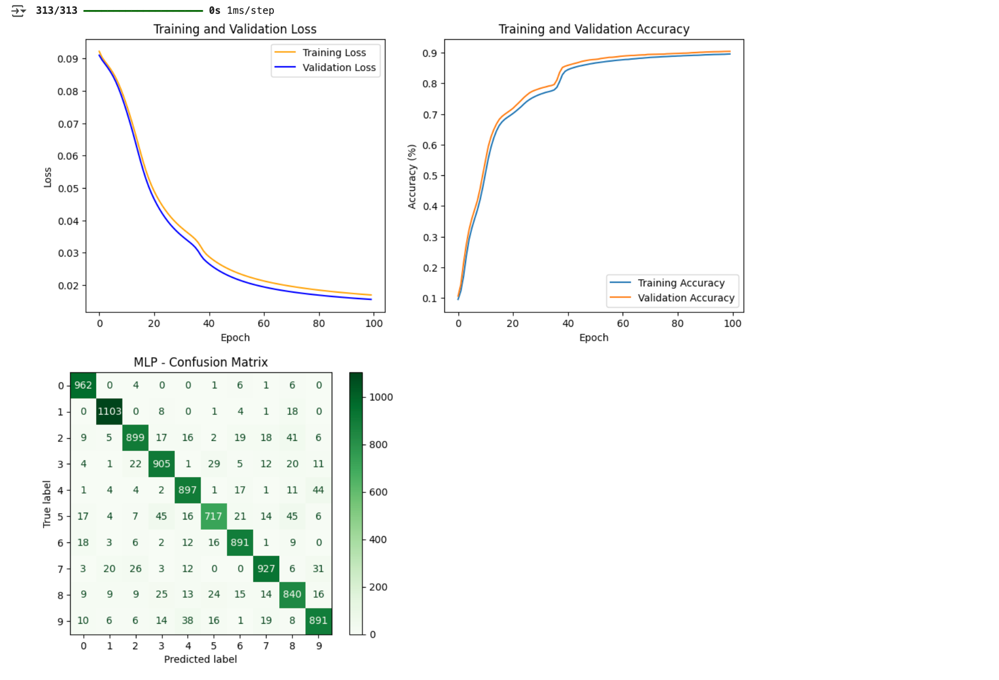
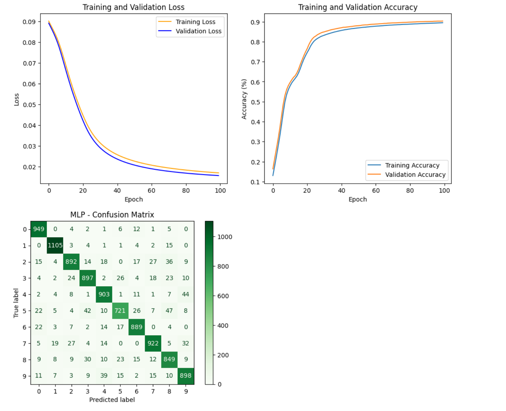
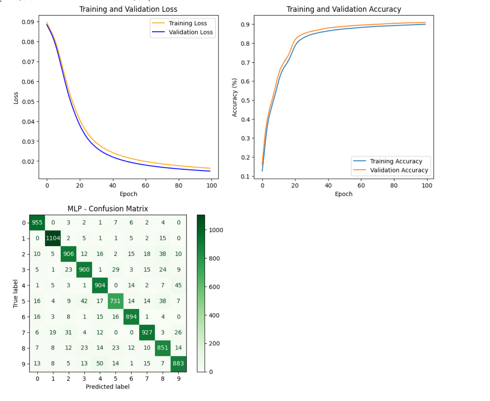
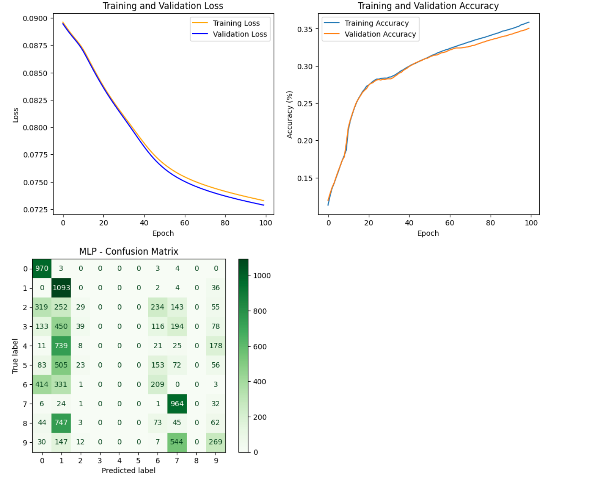
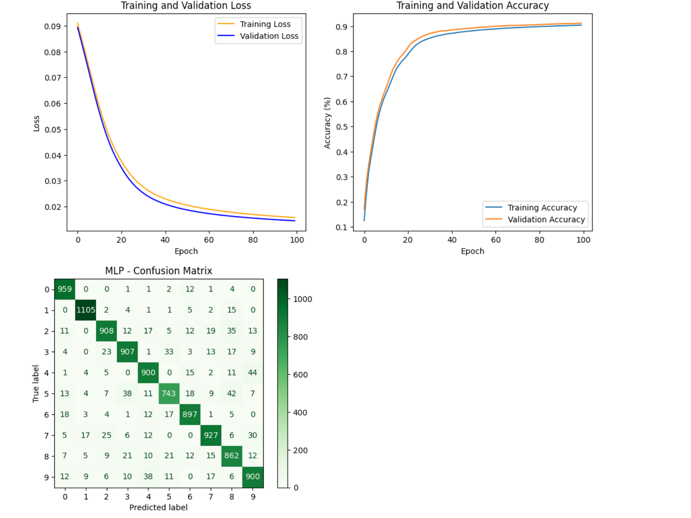
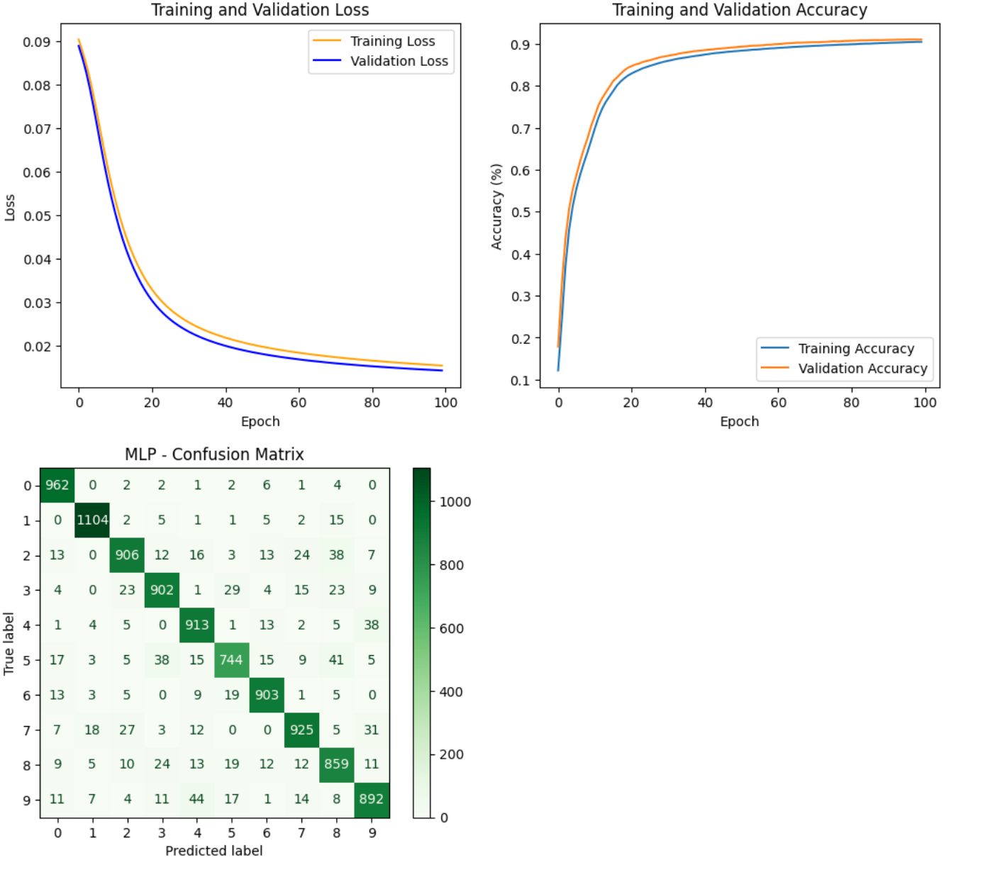

# Notes

## New Concepts Forum 1

**MLP**

MLP stands for "Multilayer Perceptron." It is a class of feedforward artificial neural network (ANN) that consists of at least three layers of nodes: an input layer, one or more hidden layers, and an output layer. Each node, except for the input nodes, is a neuron that uses a nonlinear activation function. MLPs are widely used for solving problems that require supervised learning.


**Data Augmentation**

Data augmentation is a technique used to increase the diversity of your training data without actually collecting new data. It involves creating modified versions of the existing data by applying various transformations such as rotation, translation, scaling, flipping, and adding noise. This helps improve the robustness and generalization ability of machine learning models, especially in tasks like image classification, where having a large and varied dataset is crucial.


## Activities for the Assignment
### Generate a Multilayer Perceptron (MLP) for MNIST
- Run the example and obtain results

```
# 16

num_classes = 10  # this is the number of digits
num_epochs = 5
batch_size = 100
learning_rate = 0.001
hidden_size = 16
```

Test accuracy: 89.56%


- Design the architecture (Increase the hidden_layer size)
- Train the model modify the number of epochs for training
- Evaluate the model on a validation set
- Report accuracy and discuss any challenges encountered

```
# Hyperparameters only modifying the hidden_size

num_classes = 10  # this is the number of digits
num_epochs = 5
batch_size = 100
learning_rate = 0.001
hidden_size = 32
```

Test accuracy: 90.44%


```
# Hyperparameters doubling the hidden_size + epochs

num_classes = 10  # this is the number of digits
num_epochs = 10
batch_size = 100
learning_rate = 0.001
hidden_size = 32
```

Test accuracy: 90.37% >> worse accuracy

```
# Hyperparameters doubling the hidden_size + epochs

num_classes = 10  # this is the number of digits
num_epochs = 30
batch_size = 100
learning_rate = 0.001
hidden_size = 32
```

Test accuracy: 90.41% >> worse accuracy


Setting num_epochs too low might result in underfitting, where the model does not learn enough from the data. Conversely, setting it too high might lead to overfitting, where the model learns the training data too well, including its noise, and performs poorly on unseen data. Therefore, choosing an appropriate value for num_epochs is essential for achieving a good balance between underfitting and overfitting.


**Tested with 2 hidden layers and the accuracy dropped to Test accuracy: 30.98%**

**Tested with 50 hidden layers and the accuracy went up Test accuracy: 90.71%**


**Tested with 250 hidden layers and num_epochs = 200 the accuracy went up Test accuracy: 91.19%**


### Questions to Answer

1. How long have you trained the network?
2. What accuracy do you obtain with this program?
3. What do you see analyzing the confusion matrix?
4. Do you think the program is overfitting by looking at the Loss/Accuracy plots?


---

Analyzing the confusion matrix can provide insights into the performance of your classification model. Here are some key points to consider:

1. **True Positives (TP)**: The number of correct predictions for each class.
2. **False Positives (FP)**: The number of incorrect predictions where the model predicted a class that was not the true class.
3. **False Negatives (FN)**: The number of incorrect predictions where the model failed to predict the true class.
4. **True Negatives (TN)**: The number of correct predictions where the model correctly identified that a sample does not belong to a specific class.

By examining these values, you can determine:
- **Which classes are being confused with each other**: High values in off-diagonal cells indicate that the model is confusing one class with another.
- **Class imbalance issues**: If certain classes have significantly more samples than others, it might affect the model's performance.
- **Model's strengths and weaknesses**: Identify which classes the model predicts well and which it struggles with.

For example, if the confusion matrix shows that the model frequently misclassifies digit '3' as digit '8', you might need to investigate why these digits are being confused and consider ways to improve the model's ability to distinguish between them.


---

# Confusion Matrixes for each Iteration and Accuracy Plots for each Iteration

### iteration 1



### iteration 2



### iteration 3



### iteration 4



### iteration 5



### iteration 6



### iteration 7




# Conclusions

## Summary of Iterations

| Iteration | Training Duration | Hidden Size | Test Accuracy |  
|-----------|-------------------|-------------|---------------|
| 1         | 5 epochs          | 16          | 89.56%        | 
| 2         | 5 epochs          | 32          | 90.44%        | 
| 3         | 10 epochs         | 32          | 90.37%        | 
| 4         | 30 epochs         | 32          | 90.41%        | 
| 5         | 5 epochs          | 2 layers    | 30.98%        | 
| 6         | 5 epochs          | 50 layers   | 90.71%        | 
| 7         | 200 epochs        | 250 layers  | 91.19%        | 

### Questions to Answer


#### How long have you trained the network?
1. The network was trained for different durations across various iterations. The training durations were as follows:
    - Iteration 1: 5 epochs
    - Iteration 2: 5 epochs
    - Iteration 3: 10 epochs
    - Iteration 4: 30 epochs
    - Iteration 5: 5 epochs
    - Iteration 6: 5 epochs
    - Iteration 7: 200 epochs

#### What accuracy do you obtain with this program?
2. The accuracy obtained with this program varies across different iterations. Here are the test accuracies for each iteration:
    - Iteration 1: 89.56%
    - Iteration 2: 90.44%
    - Iteration 3: 90.37%
    - Iteration 4: 90.41%
    - Iteration 5: 30.98% > Worse accuracy
    - Iteration 6: 90.71%
    - Iteration 7: 91.19% > Best accuracy

#### What do you see analyzing the confusion matrix?

Iteration 1: The confusion matrix shows that the model has a decent performance, but there are some misclassifications. For example, some digits are being confused with others, indicating areas where the model can improve.

Iteration 2: The confusion matrix shows improved performance compared to iteration 1. There are fewer misclassifications, indicating that increasing the hidden layer size has helped the model distinguish between different digits better.

Iteration 3: The confusion matrix is similar to iteration 2, with some misclassifications still present. The performance is consistent, but there is no significant improvement compared to iteration 2.

Iteration 4: The confusion matrix shows a slight improvement in performance, with fewer misclassifications compared to previous iterations. Increasing the number of epochs has helped the model learn better, but some misclassifications still exist.

Iteration 5: The accuracy dropped significantly to 30.98%, indicating that the model struggled with the increased complexity (2 hidden layers).

Iteration 6: The accuracy improved to 90.71%, suggesting that the model performed better with 50 hidden layers.

Iteration 7: The highest accuracy of 91.19% was achieved with 250 hidden layers and 200 epochs, indicating that the model benefited from the increased complexity and training duration.

#### Do you think the program is overfitting by looking at the Loss/Accuracy plots?


Iteration 1: The plot shows a decent performance with some misclassifications. There is no clear indication of overfitting.

Iteration 2: The plot shows improved performance with fewer misclassifications compared to iteration 1. There is no clear indication of overfitting.

Iteration 3: The plot is similar to iteration 2, with consistent performance and no significant signs of overfitting.

Iteration 4: The plot shows a slight improvement in performance with fewer misclassifications. There is no clear indication of overfitting.

Iteration 5: The accuracy dropped significantly to 30.98%, indicating potential issues with the model's complexity (2 hidden layers). This suggests underfitting rather than overfitting.

Iteration 6: The accuracy improved to 90.71%, suggesting better performance with 50 hidden layers. There is no clear indication of overfitting.

Iteration 7: The highest accuracy of 91.19% was achieved with 250 hidden layers and 200 epochs. Given the significant increase in complexity and training duration, there is a possibility of overfitting. However, without the actual loss/accuracy plots showing the training and validation performance, it is difficult to confirm overfitting definitively.

In summary, based on the provided plots, there is no clear indication of overfitting in iterations 1 to 6. Iteration 7 shows the highest accuracy, which might suggest overfitting due to the increased complexity and training duration, but this cannot be confirmed without the actual loss/accuracy plots showing the training and validation performance.
