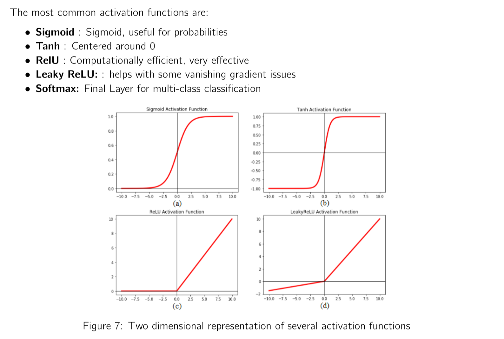
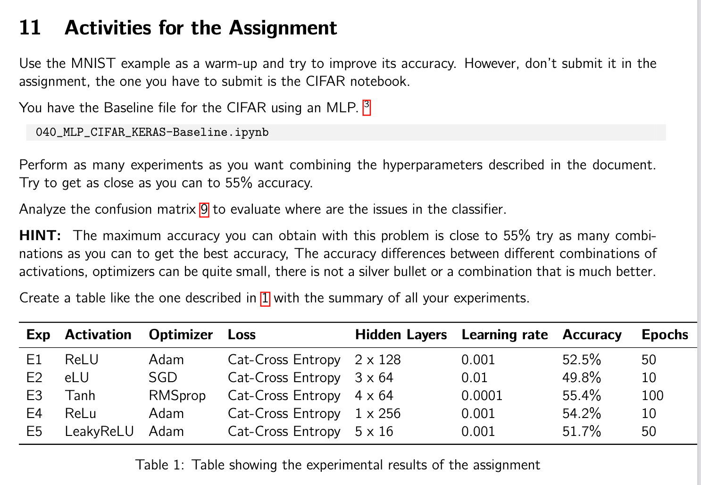

# Assignment 2

## TODO:

1. **Try Alternative Network Structures**:
   - Experiment with 3 or 4 layers.
   - Try larger layers (64, 128, 256).
   - See if your accuracy improves.

2. **Try Different Activation Functions**:
   - Experiment with ReLU, Tanh, and Leaky ReLU.
   - Use only Softmax for the final layer.
   - Note: Softmax cannot be changed because it has several properties that are crucial for multi-class classification.



3. **Adjust Training Parameters**:
    - Increase and decrease the number of epochs.
    - Change the validation split to 0.3 or even 0.4.
    - Observe any changes in the results.

4. **Evaluate Epochs to Avoid Overfitting**:
    - Examine your plots to determine if the chosen number of epochs is sufficient.
    - Ensure that the model is not overfitting.

5. **Try Different Optimizers**:
    - Experiment with SGD and Adam.
    - Compare the performance of each optimizer.
    - Note any differences in training time and accuracy.

## Activities for the Assignment


## Example experiment Results from the Assignment

| Exp | Activation | Optimizer | Loss              | Hidden Layers | Learning rate | Accuracy | Epochs |
|-----|------------|-----------|-------------------|---------------|---------------|----------|--------|
| E1  | ReLU       | Adam      | Cat-Cross Entropy | 2 x 128       | 0.001         | 52.5%    | 50     |
| E2  | eLU        | SGD       | Cat-Cross Entropy | 3 x 64        | 0.01          | 49.8%    | 10     |
| E3  | Tanh       | RMSprop   | Cat-Cross Entropy | 4 x 64        | 0.0001        | 55.4%    | 100    |
| E4  | ReLU       | Adam      | Cat-Cross Entropy | 1 x 256       | 0.001         | 54.2%    | 10     |
| E5  | LeakyReLU  | Adam      | Cat-Cross Entropy | 5 x 16        | 0.001         | 51.7%    | 50     |

Table 1: Table showing the experimental results of the assignment

## New Experiments

| Exp | Activation | Optimizer | Loss              | Hidden Layers | Learning rate | Accuracy | Epochs |
|-----|------------|-----------|-------------------|---------------|---------------|----------|--------|
| E6  | ReLU       | Adam      | Cat-Cross Entropy | 3 x 128       | 0.001         | TBD      | 75     |
| E7  | Tanh       | Adam      | Cat-Cross Entropy | 4 x 256       | 0.0005        | TBD      | 50     |
| E8  | LeakyReLU  | SGD       | Cat-Cross Entropy | 2 x 64        | 0.01          | TBD      | 100    |
| E9  | ReLU       | RMSprop   | Cat-Cross Entropy | 3 x 64        | 0.0001        | TBD      | 150    |
| E10 | Tanh       | Adam      | Cat-Cross Entropy | 4 x 128       | 0.001         | TBD      | 200    |

Table 2: Table showing the suggested experiments for further analysis

## Questions to Answer
1. Which strategy did you follow to set the parameters to optimize your network?
2. What is the best result obtained?
3. What is your learning experience from the hyperparameter setting exercise?

## Notes

When training the network, we use both forward and backward passes:
- **Forward Pass**: Calculates the accuracy (or target function) on each round or epoch.
- **Backward Pass**: Modifies the weights.

### Reference

For more detailed information, please refer to the file [Deep_Learning___Discussion_Forum_2___Training-2.pdf](#file:Deep_Learning___Discussion_Forum_2___Training-2.pdf-context).

### Example Code

```python
# Forward pass
model.predict(X_test)  # where X_test is aligned with the input

# Activate the training
model.fit(X_train, y_train, epochs=100, batch_size=100, validation_split=0.2)
```

